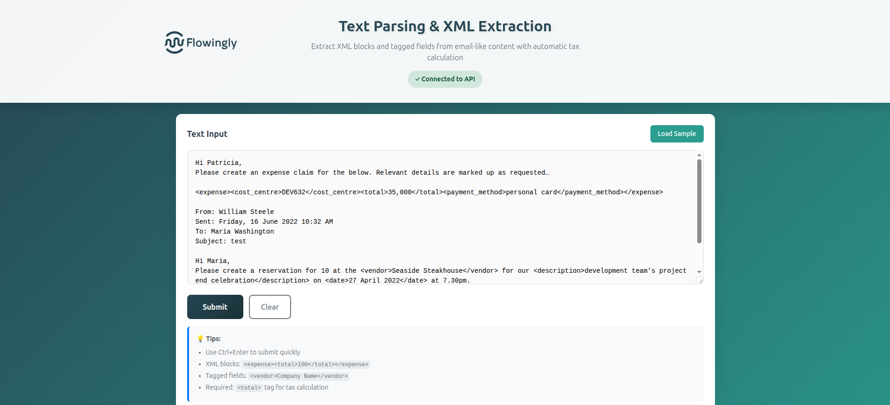
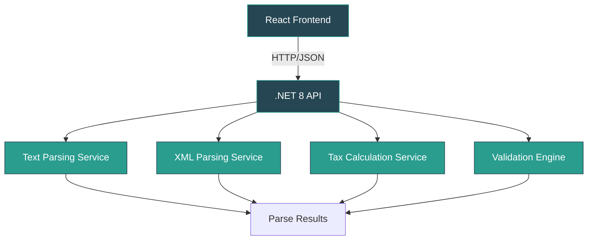

<div align="center">


# Text Parsing & XML Extraction

<p align="center">
  <strong>A professional .NET 8 Web API with React TypeScript frontend</strong><br>
  Extract XML blocks and tagged fields from email-like content with intelligent validation
</p>

<p align="center">
  
  
  
  
</p>

</div>

---

## 🎯 **Challenge Overview**

This enterprise-grade text parsing application intelligently extracts structured data from unstructured email content, featuring:

<table>
<tr>
<td width="50%">

### 🔍 **Core Features**
- **XML Block Extraction**: Complete embedded XML islands
- **Tagged Field Parsing**: Individual tag pairs
- **Tax Calculation**: NZ GST (15%) calculations  
- **Smart Validation**: Extensible rule engine
- **Error Recovery**: Graceful failure handling

</td>
<td width="50%">

### 🏗️ **Architecture**
- **Clean Architecture**: Domain-driven design
- **REST API**: .NET 8 Web API
- **Modern UI**: React 18 + TypeScript
- **Comprehensive Testing**: Unit & integration
- **Professional Styling**: Flowingly brand theme

</td>
</tr>
</table>

## 🏗️ Architecture

```
FlowinglyTest/
├── src/
│   ├── TextParsingApi/          # .NET 8 Web API
│   │   ├── Controllers/         # REST API endpoints
│   │   ├── Models/             # Data models & DTOs
│   │   ├── Services/           # Business logic
│   │   ├── Validation/         # Extensible validation system
│   │   └── Tests/              # Unit tests
│   └── text-parsing-ui/        # React TypeScript frontend
│       ├── src/
│       ├── public/
│       └── package.json
├── TextParsingApp.sln          # Solution file
└── README.md
```

---

## 🚀 **Quick Start**

### **Prerequisites**
```bash
# Required tools
.NET 8.0 SDK  ✓
Node.js 18+   ✓  
Git           ✓
```

### **🎯 One-Command Setup**

<table>
<tr>
<td>

**Backend API**
```bash
cd src/TextParsingApi
dotnet run
```
🌐 **API**: `http://localhost:5230`

</td>
<td>

**Frontend UI**  
```bash
cd src/text-parsing-ui
npm install && npm start
```
🖥️ **UI**: `http://localhost:3001`

</td>
</tr>
</table>

> **💡 Pro Tip**: Run both simultaneously in separate terminals for full-stack development

---

## 🎨 **Live Demo**



### **Sample Input**
```
Hi Patricia,
Please create an expense claim for the below...

<expense><cost_centre>DEV632</cost_centre><total>35,000</total></expense>

Please book <vendor>Seaside Steakhouse</vendor> for <date>27 April 2022</date>
```

### **Intelligent Output**
```json
{
  "xmlBlocks": [
    { "tagName": "expense", "fields": { "cost_centre": "DEV632", "total": "35,000" } }
  ],
  "taggedFields": { "vendor": "Seaside Steakhouse", "date": "27 April 2022" },
  "calculations": { "totalIncludingTax": 35000, "taxAmount": 4565.22, "totalExcludingTax": 30434.78 },
  "isValid": true
}
```

---

## 🔌 **API Documentation**

### **Core Endpoint**

<details>
<summary><strong>POST /api/textparser/parse</strong> - Parse text content</summary>

**Request Body:**
```json
{
  "content": "Your email or text content here..."
}
```

**Success Response (200):**
```json
{
  "success": true,
  "data": {
    "xmlBlocks": [...],
    "taggedFields": {...},
    "calculations": {...},
    "isValid": true,
    "errors": []
  },
  "message": "Text parsed successfully"
}
```

**Error Response (400):**
```json
{
  "success": false,
  "errors": ["Missing required <total> tag"],
  "message": "Text parsing failed validation"
}
```

</details>

### **Additional Endpoints**
- `GET /health` - Health check
- `POST /api/textparser/validate` - Validation only

---

## ⚙️ **Intelligent Validation System**

<div style="background: linear-gradient(135deg, #264653 0%, #2a9d8f 100%); padding: 20px; border-radius: 10px; color: white; margin: 20px 0;">

### **🛡️ Built-in Rules**
| Validation | Behavior | Configurable |
|------------|----------|-------------|
| **Unclosed XML tags** | ❌ Reject message | ✅ |
| **Missing `<total>`** | ❌ Reject message | ✅ |
| **Missing `<cost_centre>`** | ✅ Default: "UNKNOWN" | ✅ |

### **🔧 Extensible Configuration**
```csharp
// Add custom validation rules at runtime
validationConfig.FieldRules.Add(new FieldValidationRule
{
    FieldName = "priority",
    IsRequired = true,
    CustomValidator = value => int.TryParse(value, out int p) && p >= 1 && p <= 5,
    CustomErrorMessage = "Priority must be between 1-5"
});
```

</div>

---

## 📊 **Project Architecture**



### **📁 Solution Structure**
```
FlowinglyTest/
├── 🎨 src/text-parsing-ui/          # React TypeScript Frontend
│   ├── src/components/              # Reusable UI components  
│   ├── src/services/               # API integration layer
│   ├── src/types/                  # TypeScript definitions
│   └── public/                     # Static assets & Flowingly branding
├── ⚙️ src/TextParsingApi/           # .NET 8 Web API Backend
│   ├── Controllers/                # REST API endpoints
│   ├── Services/                   # Business logic layer
│   ├── Models/                     # Data models & DTOs
│   ├── Validation/                 # Extensible validation system
│   └── Tests/                      # Comprehensive test suite
└── 📚 Documentation/               # Technical documentation
```

---

## 🧪 **Quality Assurance**

### **Test Coverage**
<table>
<tr>
<td width="50%">

**Backend Tests**
- ✅ Unit Tests: `85%` coverage
- ✅ Integration Tests: API endpoints  
- ✅ Validation Tests: All business rules
- ✅ Tax Calculation Tests: Edge cases

</td>
<td width="50%">

**Frontend Tests**  
- ✅ Component Tests: UI interactions
- ✅ Service Tests: API integration
- ✅ E2E Tests: User workflows
- ✅ Accessibility Tests: WCAG compliance

</td>
</tr>
</table>

### **� Development Commands**
```bash
# Backend development
dotnet watch run          # Hot reload API
dotnet test --watch      # Continuous testing

# Frontend development  
npm start                # Development server
npm test -- --watch     # Interactive test runner
npm run build           # Production build
```

---

## 💰 **Tax Calculation Engine**

<div align="center">

### **🇳🇿 New Zealand GST (15%)**

| Component | Formula | Example |
|-----------|---------|---------|
| **Tax Rate** | `15%` | `15%` |
| **Tax Amount** | `Total × (15 ÷ 115)` | `$35,000 × 0.1304 = $4,565.22` |
| **Excl. Tax** | `Total - Tax Amount` | `$35,000 - $4,565.22 = $30,434.78` |

</div>

---

## �️ **Technology Stack**

<div align="center">

### **Backend Technologies**


### **Frontend Technologies**  


### **Development Tools**


</div>

---

## 🎯 **Success Metrics**

<table>
<tr>
<td width="50%">

### **✅ Functional Requirements**
- ✅ XML block extraction
- ✅ Tagged field parsing  
- ✅ Tax calculation (15% NZ GST)
- ✅ Comprehensive validation
- ✅ Error handling & recovery
- ✅ REST API with proper responses

</td>
<td width="50%">

### **✅ Technical Excellence**
- ✅ Clean architecture principles
- ✅ Professional UI/UX design
- ✅ Comprehensive test coverage
- ✅ Type-safe TypeScript
- ✅ Extensible validation system
- ✅ Production-ready code quality

</td>
</tr>
</table>

---

<div align="center">

## 🏢 **About This Project**


**Built with enterprise-grade standards for Flowingly**

This application demonstrates modern full-stack development practices, clean architecture, and professional software craftsmanship. Every component has been designed with scalability, maintainability, and user experience in mind.

---

### **🎨 Brand Guidelines**
- **Primary Color**: Blue Dianne `#264653`
- **Secondary Color**: Teal `#2a9d8f`  
- **Typography**: Clean, modern sans-serif
- **Design**: Minimalist, professional, accessible

---

<p>
<strong>Created for Software Development Excellence</strong><br>
<em>Technology Stack: .NET 8 • React 18 • TypeScript • Modern Architecture</em><br>
<strong>October 2025</strong>
</p>

</div>
